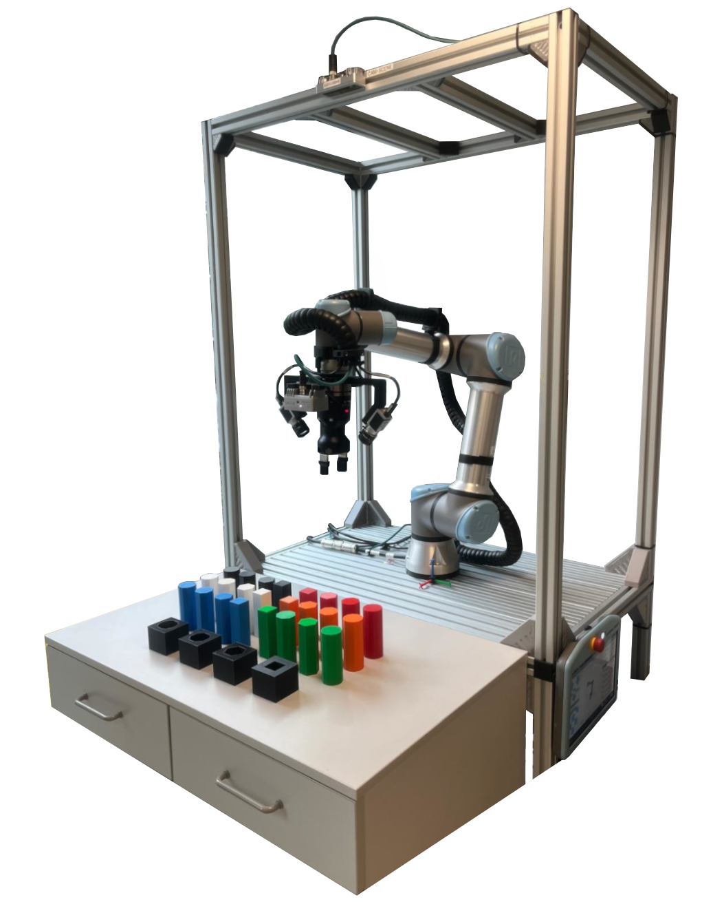

# aegis_ros

[](https://opensource.org/licenses/Apache-2.0)
[](https://github.com/pre-commit/pre-commit)
[](https://doi.org/10.5281/zenodo.17018771)

A complete suite of ROS 2 packages for the Aegis UR5e cobot station.

<p align="center">
    
</p>

---

## List of packages

* `aegis`: The meta-package for referencing all project dependencies.
* [aegis_control](./aegis_control/README.md): Launch files dedicated to the hardware drivers based on the [ros2_control](https://control.ros.org/humble/doc/getting_started/getting_started.html) framework.
* [aegis_bringup](./aegis_bringup/README.md): The main launch file.
* [aegis_description](./aegis_description/README.md): The description and configuration files of the Aegis robot station.
* [aegis_director](./aegis_director/README.md): The "main" function for the robot workflow.
* [aegis_moveit_config](./aegis_moveit_config/README.md): The configuration to run the [MoveIt 2](https://moveit.picknik.ai/main/index.html) framework.
* [aegis_utils](./aegis_utils/README.md): Various utility functions and tools.

---

## Quick start

### Create workspace

```bash
mkdir -p ~/ceai_ws
cd ~/ceai_ws
git clone -b humble-devel https://github.com/AGH-CEAI/aegis_ros.git src/aegis_ros
```

### Containers

> [!TIP]
> Check the [aegis_docker](https://github.com/AGH-CEAI/aegis_docker) repository for the Dockerfile.

#### Docker
```bash
cd ~/ceai_ws/src/aegis_docker
docker build . -t ceai/aegis_dev:latest
#TODO add more examples
```

#### Podman & Toolbx
```bash
cd ~/ceai_ws/src/aegis_docker
podman build . -t ceai/aegis_dev:latest
toolbox create --image localhost/ceai/aegis_dev:latest
toolbox enter aegis_dev-latest
```

### Resolving dependencies and build
```bash
source /opt/ros/humble/setup.bash
rosdep init
```
```bash
cd ~/ceai_ws
vcs import src < src/aegis_ros/aegis/aegis.repos
rosdep update --rosdistro $ROS_DISTRO
rosdep install --from-paths src -y -i
colcon build --symlink-install
source ./install/local_setup.bash
```

### Driver installation - Basler cameras (Manually)

Due to licence conditions each user must download drivers for basler cameras directly from their page.
Download from [pylon Camera Software Suite](https://www.baslerweb.com/en/products/software/basler-pylon-camera-software-suite) `pylon` and `blaze` and install packages inside the container. [See more here](https://github.com/basler/pylon-ros-camera/tree/humble). Extract downloaded files and execute:

```bash
sudo apt update
sudo apt-get install -y libxcb-cursor-dev
sudo apt-get install ./pylon_*.deb ./codemeter*.deb
sudo apt-get install ./pylon-supplementary-package-for-blaze-*.deb
echo $PYLON_ROOT
```
You should see `/opt/pylon` in terminal. Build project and ignore warnings that may appear.

### Run

See the [aegis_bringup](./aegis_bringup/README.md) package.

### Camera calibration

See the [aegis_utils](./aegis_utils/README.md) package.


---
## Development notes

This project uses various tools for aiding the quality of the source code. Currently most of them are executed by the `pre-commit`. Please make sure to enable its hooks:

```bash
pre-commit install
```

---
## License
This repository is licensed under the Apache 2.0, see LICENSE for details.
