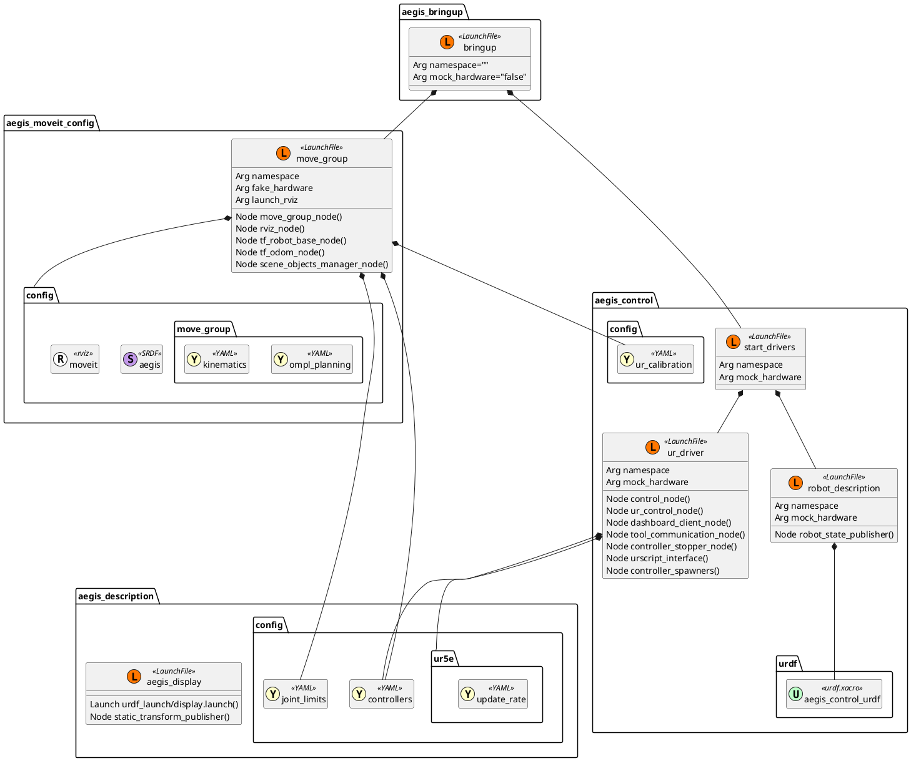

# aegis_bringup

This package provides the configuration and launch files required to enable all basic functionalities of the Aegis robot station.

## Launch files

- `bringup.launch.py`: Responsible for running the entire ROS 2 stack for the robot station.

## Run the project

> [!CAUTION]
> Never startup the project on the real hardware unattended!

1. Ensure that the `ros2_driver` program on the robot is loaded, and the robot is set to the `Remote` mode (the top-right corner on the teach pendant).

2. Run the main launch file:
```bash
ros2 launch aegis_bringup bringup.launch.py
```

3. Apply the hotfix publisher for the gripper state:
```bash
ros2 topic pub /joint_states sensor_msgs/msg/JointState \
"header:
  stamp:
    sec: 0
    nanosec: 0
  frame_id: ''
name: ["hande_right_finger_joint", "hande_left_finger_joint"]
position: [0.025, 0.025]
velocity: [0.0, 0.0]
effort: [0.0, 0.0]"
```

4. Start the client program on the robot via dashboard service:
```bash
ros2 service call /dashboard_client/play std_srvs/srv/Trigger {}
```

## Launch files diagram

TODO - embed dynamic PlantUML generation:
```markdown
![alternative text](http://www.plantuml.com/plantuml/proxy?cache=no&src=https://raw.github.com/plantuml/plantuml-server/master/src/main/webapp/resource/test2diagrams.txt
```


