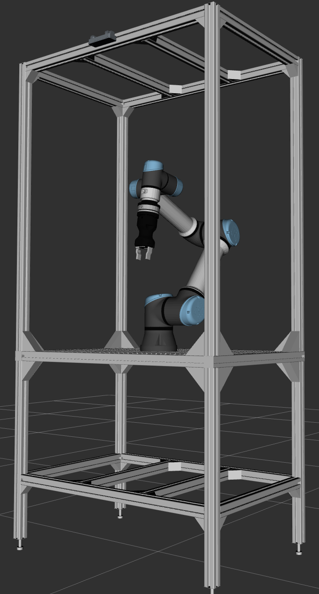
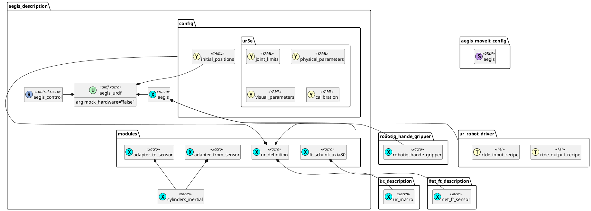

# aegis_description

This package contains a description of the Aegis robot station, which consists of the following modules:
- UR5e series
- SCHUNK FT Sensor AXIA 80
- Robotiq Hand-E Gripper

## Preview

```bash
ros2 launch aegis_description display.launch.py
```



## Configuration files

```
aegis_description/
├── config
│   ├── ur5e
│   │   ├── calibration.yaml
│   │   ├── joint_limits.yaml
│   │   ├── physical_parameters.yaml
│   │   ├── update_rate.yaml
│   │   └── visual_parameters.yaml
│   ├── controllers.yaml
│   └── initial_positions.yaml
```

Legend:
* 📜 - URDFs
* 🚀 - Launch Files

| File                                                                           | Used in | Description                                                                                             |
| ------------------------------------------------------------------------------ | ------- | ------------------------------------------------------------------------------------------------------- |
| [config/ur5e/calibration.yaml](./config/ur5e/calibration.yaml)                 | 📜🚀    | The calibration parameters extracted from the UR5e robot.                                               |
| [config/ur5e/joint_limits.yaml](./config/ur5e/joint_limits.yaml)               | 📜🚀    | Limits for each of the joints, used both by the `ur_robot_driver` and `aegis_moveit_config`.            |
| [config/ur5e/physical_parameters.yaml](./config/ur5e/physical_parameters.yaml) | 📜      | Reference of the masses and interias taken from the official `ur_robot_driver`.                         |
| [config/ur5e/update_rate.yaml](./config/ur5e/update_rate.yaml)                 | 🚀      | Configuration for the `controller_manager` Node taken from the `ur_robot_driver`.                       |
| [config/ur5e/visual_parameters.yaml](./config/ur5e/visual_parameters.yaml)     | 📜      | Paths to the UR5e meshes in the `ur_description` package.                                               |
| [config/controllers.yaml](./config/controllers.yaml)                           | 🚀      | Config for the `ros2_control` controllers, mix of `ur_robot_driver` and MoveIt2 Setup Assistant output. |
| [config/initial_positions.yaml](./config/initial_positions.yaml)               | 📜      | Default joints positions.                                                                               |


## URDF files diagram

TODO - embed dynamic PlantUML generation:
```markdown
![alternative text](http://www.plantuml.com/plantuml/proxy?cache=no&src=https://raw.github.com/plantuml/plantuml-server/master/src/main/webapp/resource/test2diagrams.txt
```


