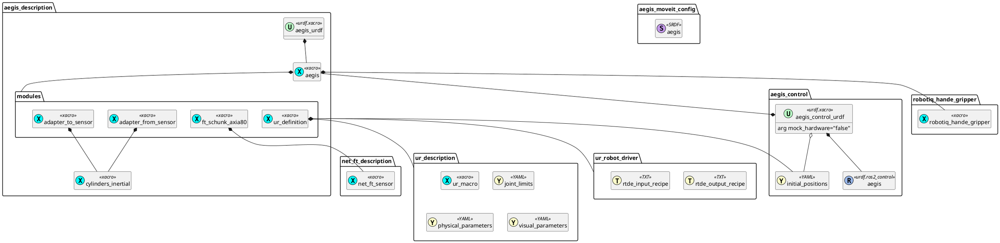

# aegis_description

This package contains a description of the Aegis robot station, which consists of the following modules:
- UR5e series
- SCHUNK FT Sensor AXIA 80
- Robotiq Hand-E Gripper

## Preview

```bash
ros2 launch aegis_description display.launch.py
```


## URDF files diagram


