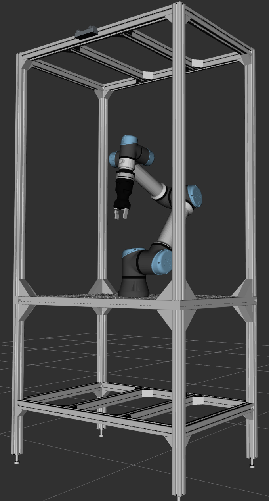

# aegis_description

This package contains a description of the Aegis robot station, which consists of the following modules:
- Cell
- UR5e Series Robot
- Adapter Robot-Sensor
- Adapter Sensor-Manipulator
- Mount for Basler Tool Camera
- Mount for Luxonis Tool Camera
- SCHUNK AXIA 80 FT Sensor
- Robotiq Hand-E Gripper
- Luxonis OAK-D Pro Camera
- Luxonis OAK-D SR Camera
- Basler ace acA1920-40gc Camera
- Computar Lens for Basler Tool Camera

## Preview

```bash
ros2 launch aegis_description display.launch.py
```



## Files documentation

```
aegis_description/
├── config
│   ├── ur5e
│   │   ├── calibration.yaml
│   │   ├── joint_limits.yaml
│   │   ├── physical_parameters.yaml
│   │   ├── update_rate.yaml
│   │   └── visual_parameters.yaml
│   ├── controllers.yaml
│   └── initial_positions.yaml
├── launch
│   ├── aegis_preview.launch.py
│   └── robot_description.launch.py
├── urdf
│   ├── aegis.urdf.xacro
│   └── aegis.xacro
└── rviz
    └── preview.rviz
```

Legend:
* 📜 - URDF files
* 🚀 - Launch files

| File                                                                           | Used in | Description                                                                                                             |
| ------------------------------------------------------------------------------ | ------- | ----------------------------------------------------------------------------------------------------------------------- |
| [config/ur5e/calibration.yaml](./config/ur5e/calibration.yaml)                 | 📜🚀      | Calibration parameters extracted from the UR5e robot.                                                                   |
| [config/ur5e/joint_limits.yaml](./config/ur5e/joint_limits.yaml)               | 📜🚀      | Joint limits used by both `ur_robot_driver` and `aegis_moveit_config`.                                                  |
| [config/ur5e/physical_parameters.yaml](./config/ur5e/physical_parameters.yaml) | 📜       | Reference to masses and intertias taken from the official `ur_robot_driver`.                                            |
| [config/ur5e/update_rate.yaml](./config/ur5e/update_rate.yaml)                 | 🚀       | Configuration for the `controller_manager` node from the `ur_robot_driver`.                                             |
| [config/ur5e/visual_parameters.yaml](./config/ur5e/visual_parameters.yaml)     | 📜       | Paths to the UR5e meshes in the `ur_description` package.                                                               |
| [config/controllers.yaml](./config/controllers.yaml)                           | 🚀       | Configuration for the `ros2_control` controllers, combining outputs from `ur_robot_driver` and MoveIt2 Setup Assistant. |
| [config/initial_positions.yaml](./config/initial_positions.yaml)               | 📜       | Default joints positions.                                                                                               |
| [launch/aegis_preview.launch.py](./launch/aegis_preview.launch.py)             |         | Simple launch file to preview in RViz the Aegis model.                                                                  |
| [launch/robot_description.launch.py](./launch/robot_description.launch.py)     |         | Launch file to run the robot description node with the Aegis URDF model.                                                |
| [rviz/preview.rviz](./rviz/preview.rviz)                                       | 🚀       | Default RViz configuration for the `aegis_display.launch.py`                                                            |
| [urdf/aegis.urdf.xacro](./urdf/aegis.urdf.xacro)                               | 🚀       | The main URDF file, which defines the initial link for the `aegis.xacro` file.                                          |
| [urdf/aegis.xacro](./urdf/aegis.xacro)                                         | 📜       | The main xacro file, which imports all modules from the `urdf/modules/` dir.                                            |


## URDF files diagram


